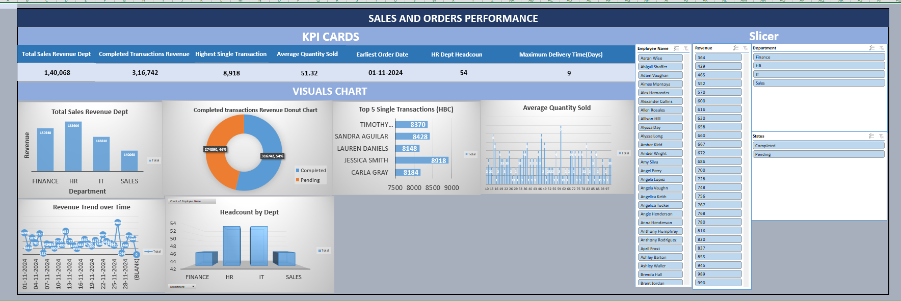

# Sales-Orders-Performance-Analytics-Beginner-Excel-1
Interactive Excel dashboard analyzing sales metrics, built to showcase foundational data analytics skills.
# 📊 Sales and Order Performance Dashboard

## 📌 Project Overview
This repository contains an interactive data analytics dashboard built entirely in Microsoft Excel. The project transforms raw transactional data into a dynamic reporting tool that tracks core revenue metrics, evaluates employee performance.
This project was built to demonstrate a structured, technical approach to data analytics, focusing on data integrity, logical formulas, and interactive visualization.

## 🛠️ Excel Skills Demonstrated
* **Data Validation & Logic:** Applied boolean logic (`AND`, `<`) combined with conditional formatting.
* **Advanced Aggregations:** Utilized functions such as `SUMPRODUCT`, `SUMIF`, `COUNTIF`, and dynamic arrays to build a robust backend calculation engine.
* **Interactive Visualizations:** Engineered a frontend user interface utilizing interconnected PivotCharts, Histograms, Donut Charts, and Global Slicers for seamless data filtering.
* **UI/UX Design:** Separated the backend data processing from the frontend presentation to create a clean, corporate-standard dashboard.

## 📈 Key Business Questions Answered
The dashboard dynamically calculates and visualizes answers to the following operational metrics:
1. What is the total revenue generated specifically by the Sales department?
2. What is the revenue breakdown by order status (Pending vs. Completed)?
3. Who are the top 5 employees based on single-transaction maximum revenue?
4. What is the distribution and average of the quantity of products sold?
5. How is revenue trending over time based on order dates?
6. What is the total headcount distribution across all corporate departments?

## 📸 Dashboard Preview

*(Note: Ensure the uploaded screenshot in the repository is named exactly `dashboard_view.png` for this image to display.)*

## 📁 Repository Contents
* `Employee_Sales_1.xlsx`: The finalized interactive dashboard containing the raw data, calculation backend, and frontend visualizations.
* `employee_sales_Dataset.csv`: The raw, unprocessed dataset used for this analysis.
* `dashboard_view.png`: A high-resolution static preview of the dashboard interface.

## ⚙️ How to Use This Dashboard
1. Download the `.xlsx` file and open it in Microsoft Excel.
2. Navigate to the **Dashboard** tab.
3. Use the Slicer buttons on the left panel to filter the metrics and charts by specific Departments or Order Statuses.
